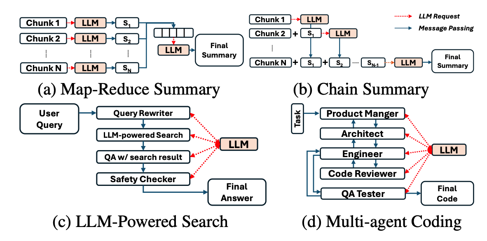

# 🦜 Parrot: Efficient Serving of LLM-based Application with Semantic Variable

[Paper](https://www.usenix.org/system/files/osdi24-lin-chaofan.pdf) | [Documentation](docs/) | [Slides](assets/Parrot-OSDI24.pdf) | [Poster](assets/Parrot_Poster_OSDI_24.pdf)

> This repo is current a research prototype. Please open issue or contact the authors when you need help.

Parrot is a distributed, multi-tenant serving system for **LLM-based Applications**. With the Semantic Variable abstraction, Parrot can easily grasp the **app-level information** like LLM computation graph (DAG) or the prompt structure, which enables many interesting features like:
- Automatically parallelize and batch LLM requests in complex LLM applications. Asynchronous communication between dependent requests.
- Performance objective deduction and DAG-aware scheduling.
- Sharing common prompt prefix between requests with optimized attention kernel, Context-aware scheduling.

## What's LLM Applications?

The powerful language understanding capability of large language models (LLMs) has enabled a new application paradigm, where one or multiple application entities, known as AI agents or co-pilots, communicate with LLMs via natural language, known as “prompts”, to accomplish a task collaboratively. 

Parrot is designed to serve these LLM-based applications efficiently by adding `Semantic Variable` in current OpenAI-style API, exposing richer application-level knowledge to backend systems and engines for better optimization.

<div align="center">
  
</div>

For more background knowledge and our motivation, please refer our OSDI'24 paper [Parrot: Efficient Serving of LLM-based Applications with Semantic Variable](https://www.usenix.org/system/files/osdi24-lin-chaofan.pdf).

## 🚀 News

- [2024/08] A [Post](https://mp.weixin.qq.com/s/3wAgV9ehbqgk_gVhSGYARQ) about Parrot is published in the WeChat account of MSRA (Microsoft Research Asia)!
- [2024/07] Parrot is published and presented in OSDI'24. Please find the paper and presentation [Here](https://www.usenix.org/conference/osdi24/presentation/lin-chaofan) if you are interested!
- [2024/06] Blogs about the technical details behind Parrot: [Blog (Chinese)](https://me.tric.space/2024/06/22/parrot-osdi24/) or [Blog Zhihu (Chinese)](https://zhuanlan.zhihu.com/p/704330977).
- [2024/04] Release Parrot as a Microsoft open source project.
- [2024/03] Parrot has been accepted to **OSDI'24**!


## Install

See [INSTALL](docs/get_started/installation.md) for installation instructions.

## [Documentations](docs/)

- [Get Started](docs/get_started/): In this chapter, you will learn how to install Parrot and run your first application using Parrot.
- [Documentation for Users](docs/user_docs/): User documentation of Parrot. It contains the API specification of Parrot's OpenAI-like API, and the grammar of Parrot's frontend `pfunc`.
- [Parrot System Design](docs/sys_design/): If you want to hack/modify Parrot, it's what you need. This chapter offers an overview of Parrot's system architecture and provides detailed explanation of Parrot's internal code organization and implementation.  
- [Version Drafts](docs/version_drafts/): Learn about the refactor history and some of our brainstorm ideas when developing Parrot from these drafts.

## Acknowledgement

We learned a lot from the following projects when developing Parrot.
- [vLLM](https://github.com/vllm-project/vllm)
- [LightLLM](https://github.com/ModelTC/lightllm)
- [Flash Attention](https://github.com/Dao-AILab/flash-attention)

## Reference

If you find Parrot useful or relevant to your research, please cite our paper as below:

```
@inproceedings{lin2024parrot,
    author = {Chaofan Lin and Zhenhua Han and Chengruidong Zhang and Yuqing Yang and Fan Yang and Chen Chen and Lili Qiu},
    title = {Parrot: Efficient Serving of LLM-based Applications with Semantic Variable},
    booktitle = {18th USENIX Symposium on Operating Systems Design and Implementation (OSDI 24)},
    year = {2024},
    address = {Santa Clara, CA},
    publisher = {USENIX Association},
    url = {https://www.usenix.org/conference/osdi24/presentation/lin-chaofan},
    month = jul
}
```

## Contributing

This project welcomes contributions and suggestions.  Most contributions require you to agree to a
Contributor License Agreement (CLA) declaring that you have the right to, and actually do, grant us
the rights to use your contribution. For details, visit https://cla.opensource.microsoft.com.

When you submit a pull request, a CLA bot will automatically determine whether you need to provide
a CLA and decorate the PR appropriately (e.g., status check, comment). Simply follow the instructions
provided by the bot. You will only need to do this once across all repos using our CLA.

This project has adopted the [Microsoft Open Source Code of Conduct](https://opensource.microsoft.com/codeofconduct/).
For more information see the [Code of Conduct FAQ](https://opensource.microsoft.com/codeofconduct/faq/) or
contact [opencode@microsoft.com](mailto:opencode@microsoft.com) with any additional questions or comments.

## Trademarks

This project may contain trademarks or logos for projects, products, or services. Authorized use of Microsoft
trademarks or logos is subject to and must follow
[Microsoft's Trademark & Brand Guidelines](https://www.microsoft.com/en-us/legal/intellectualproperty/trademarks/usage/general).
Use of Microsoft trademarks or logos in modified versions of this project must not cause confusion or imply Microsoft sponsorship.
Any use of third-party trademarks or logos are subject to those third-party's policies.
