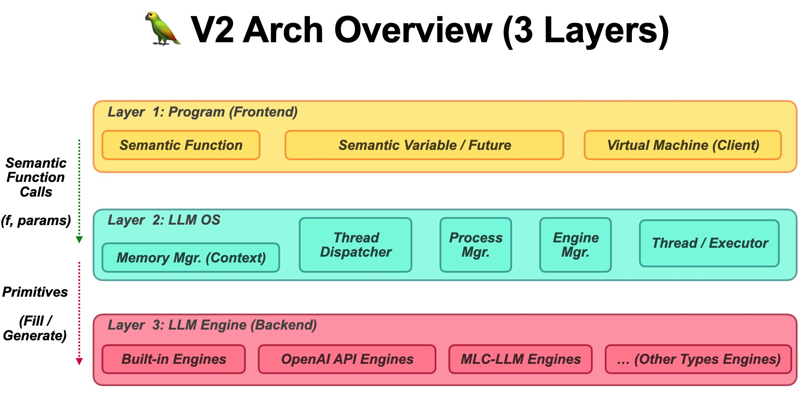

# Parrot: Efficient Serving of LLM-based Application with Semantic Variables

This project is a research prototype for now. Being eargerly iterated.




## Install

See [INSTALL.md](INSTALL.md) for installation instructions.

## Run Parrot

**Run the Compose Script in a Single Machine**

We provide some one-click scripts to run Parrot in a single machine with sample configs. You can check them in the `sample_configs/launch` folder.

```bash
bash sample_configs/launch/launch_single_vicuna_13b.sh
```

<!-- **Run Docker Compose in a Cluster**

TODO -->

**Start a ServeCore Server**

You can separately start a ServeCore server.

```bash
python3 -m parrot.serve.http_server --config_path <config_path>
```

**Start an Engine Server**

You can separately start an engine server. If you choose to connect to the ServeCore server, you need to start the ServeCore server first and specify the ServeCore server address in the config file.

```bash
python3 -m parrot.engine.http_server --config_path <config_path>
```