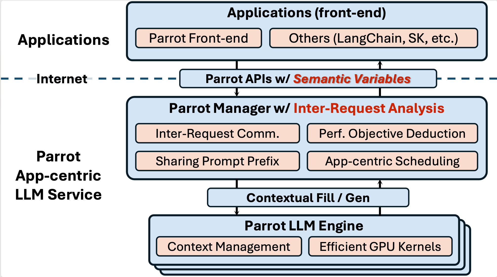

# Parrot: Efficient Serving of LLM-based Application with Semantic Variable

[[Paper](https://arxiv.org/abs/2405.19888)]

> This project is a research prototype for now. Being eargerly iterated.

Parrot is a distributed serving system for LLM-based Applications. The Parrot API w/ Semantic Variable is served by a centralized cluster manager called `ServeCore`, which manages many `Engine` instances. Each Parrot `Engine` runs a single LLM model and communicates with `ServeCore` by contextual Fill/Gen APIs. Note that each `Engine` is capable of providing language model services independently, therefore the system is horizontally scalable and many types of `Engine`s can be integrated into Parrot (e.g., vLLM, FasterTransformer, etc.).

<div align="center">
  
</div>

## LLM Applications

The powerful language understanding capability of large language models (LLMs) has enabled a new application paradigm, where one or multiple application entities, known as AI agents or co-pilots, communicate with LLMs via natural language, known as “prompts”, to accomplish a task collaboratively. Parrot is designed to serve these LLM-based applications efficiently by adding `Semantic Variable` in current OpenAI-style API, exposing richer application-level knowledge to backend systems and engines for better optimization.

<div align="center">
  
</div>

## Install

See [INSTALL.md](INSTALL.md) for installation instructions.

## Run Parrot

**Run the Compose Script in a Single Machine**

We provide some one-click scripts to run Parrot in a single machine with sample configs. You can check them in the `sample_configs/launch` folder.

```bash
bash sample_configs/launch/launch_single_vicuna_13b.sh
```

<!-- **Run Docker Compose in a Cluster**

TODO -->

**Start a ServeCore Server**

You can separately start a ServeCore server.

```bash
python3 -m parrot.serve.http_server --config_path <config_path>
```

**Start an Engine Server**

You can separately start an engine server. If you choose to connect to the ServeCore server, you need to start the ServeCore server first and specify the ServeCore server address in the config file.

```bash
python3 -m parrot.engine.http_server --config_path <config_path>
```

## Reference

If you find Parrot useful or relevant to your research, please cite our paper as below:

```
@inproceedings{parrot,
    author = {Chaofan Lin and Zhenhua Han and Chengruidong Zhang and Yuqing Yang and Fan Yang and Chen Chen and Lili Qiu},
    title = {Parrot: Efficient Serving of LLM-based Applications with Semantic Variable},
    booktitle = {18th USENIX Symposium on Operating Systems Design and Implementation (OSDI 24)},
    year = {2024},
    address = {Santa Clara, CA},
    publisher = {USENIX Association},
    url = {https://www.usenix.org/conference/osdi24/presentation/lin-chaofan},
    month = jul
}
```

## Contributing

This project welcomes contributions and suggestions.  Most contributions require you to agree to a
Contributor License Agreement (CLA) declaring that you have the right to, and actually do, grant us
the rights to use your contribution. For details, visit https://cla.opensource.microsoft.com.

When you submit a pull request, a CLA bot will automatically determine whether you need to provide
a CLA and decorate the PR appropriately (e.g., status check, comment). Simply follow the instructions
provided by the bot. You will only need to do this once across all repos using our CLA.

This project has adopted the [Microsoft Open Source Code of Conduct](https://opensource.microsoft.com/codeofconduct/).
For more information see the [Code of Conduct FAQ](https://opensource.microsoft.com/codeofconduct/faq/) or
contact [opencode@microsoft.com](mailto:opencode@microsoft.com) with any additional questions or comments.

## Trademarks

This project may contain trademarks or logos for projects, products, or services. Authorized use of Microsoft 
trademarks or logos is subject to and must follow 
[Microsoft's Trademark & Brand Guidelines](https://www.microsoft.com/en-us/legal/intellectualproperty/trademarks/usage/general).
Use of Microsoft trademarks or logos in modified versions of this project must not cause confusion or imply Microsoft sponsorship.
Any use of third-party trademarks or logos are subject to those third-party's policies.