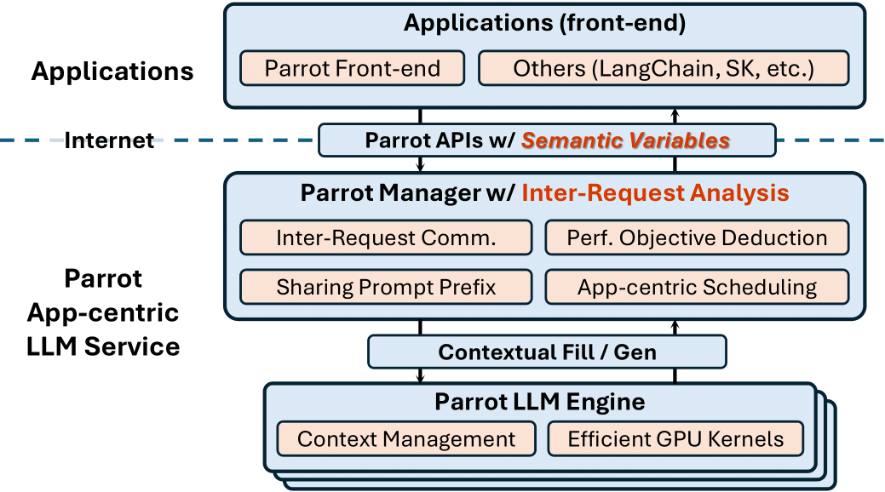

# Parrot's System Design

Parrot is a distributed serving system for LLM-based Applications. It can be divided into three layers basically:
- [Application Layer](app_layer/):
    - Parrot's LLM programming frontend: [PFunc](app_layer/pfunc.md).
    - [Semantic Variable](app_layer/semantic_variable.md).
- [Serve Layer](serve_layer/):
    - [ServeCore](serve_layer/core.md), a.k.a. Parrot Manager.
    - [Global Scheduler](serve_layer/global_scheduler.md).
    - [Parrot's Graph Representation](serve_layer/graph.md).
    - [Parrot's Graph Executor](serve_layer/executor.md), read how Parrot efficiently executes a DAG of requests.
    - [Context](serve_layer/context.md), read the cluster-level memory management of Parrot.
    - [Engines](serve_layer/engines.md), read the management of engines.
    - [Sessions](serve_layer/sessions.md), read the management of sessions.
    - [Semantic Variable Manager](serve_layer/sv_manager.md), read the management of Semantic Variable.
- [Engine Layer](engine_layer/):
    - [Internal APIs](engine_layer/engine_apis.md) between `ServeCore` and `Engine`.
    - [Builtin Engine](engine_layer/builtin_engine.md).
    - [OpenAI Engine](engine_layer/openai_engine.md).
    - [Shared Attention Kernel](engine_layer/shared_attention_kernel.md)

## Overview

The Parrot API w/ Semantic Variable is served by a centralized cluster manager called `ServeCore`, which manages many `Engine` instances.

`ServeCore` serves the [Parrot APIs w/ Semantic Variable](../user_docs/parrot_apis.md). It also responsible for managing everything in the cluster and scheduling requests (`GlobalScheduler`).
Most optimizations and scheduling strategies in Parrot are implemented in `ServeCore`.

Each Parrot `Engine` runs a single LLM model and communicates with `ServeCore` by contextual Fill/Gen APIs. Note that:
 - **Engine server is independent**: Each `Engine` is capable of providing language model services independently. Each `Engine` has its own scheduler (We call it `LocalScheduler`) to perform common techniques like [Continous Batching](https://www.usenix.org/conference/osdi22/presentation/yu). And there are also many kernel-level optimizations (e.g. [PagedAttention](https://arxiv.org/abs/2309.06180), Sharing Prompts) in our builtin engine implementation.
- **Engine is an abstraction**: Any server which can implement our internal `Engine APIs` can be registered as an `Engine` in Parrot, therefore the system is horizontally scalable and many types of `Engine`s can be integrated into Parrot (e.g., vLLM, FasterTransformer, etc.) easily.
    
    > For example, you can use a distributed serving mechanism (like tensor parallelism) in a single multi-GPU machine or multi machines, expose a single HTTP server w/ our Engine APIs and register it as a `Engine`.

The following picture illustrates the overview architecture of Parrot. Please refer our OSDI'24 paper [Parrot: Efficient Serving of LLM-based Applications with Semantic Variable](https://www.usenix.org/system/files/osdi24-lin-chaofan.pdf) for more details.

<div align="center">
  
</div>


## Code Structure

The code of Parrot is organized basically by the above three-layer architecture.

```python
parrot/
    frontend/
        pfunc/ # PFunc frontend
    serve/ # Serve Layer
    engine/ # Engine Layer
    protocol/ # Common Protocols & APIs
    utils/ # Utilities (logging, async, recycle pool, ...)
    testing/ # Test related tools
```