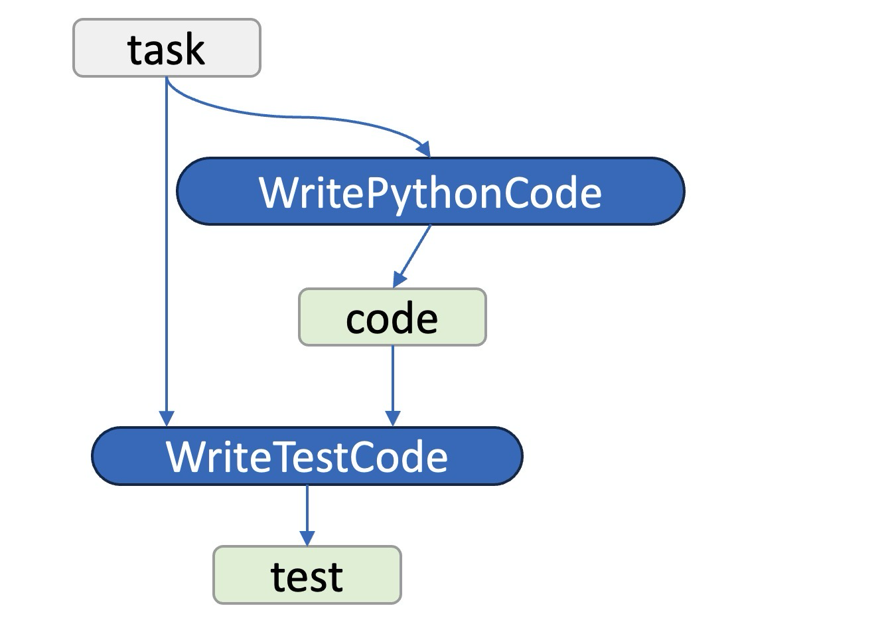

# Semantic Variable

## Motivation

Semantic Variable is the core of Parrot system as it's mentioned in our paper. The main idea behind Semantic Variable is that if we want to optimize LLM Applications in a perspective higher than per-request, we need a representation which **exists independently of LLM requests and connects those requests**.

## Introduction

In [PFunc introduction](pfunc.md), we have defined a LLM request as a semantic function. Hence we name "things that connect these functions, i.e., serve as their inputs/outputs" as semantic variable for the sake of naming consistency.

As the above picture shows, a Semantic Variable can be an Input/Output of a Semantic Function. In this picture, `WritePythonCode` and `WriteTestCode` are two LLM requests / Semantic Functions while `task`, `code` and `test` are three Semantic Variables. Also, a Semantic Variable can be a text constant or user input (e.g. `task` in this picture). In a word, a Semantic Variable is **a placeholder for text content with a cross-request scope** and **exposed to backend** serving system for graph building, analyzing and optimizing.

## Two Basic Operations

To allow the system able to fetch the computation graph, Parrot uses an asynchronous pattern in Semantic Variable APIs design. To be specific, comparing to traditional completion request, Parrot separates it into two atomic primitives:

- `submit`: Submit a request to Parrot serve layer, with input/output semantic variables specified.
- `get`: Get the value of a Semantic Variable.

That is to say, when calling a semantic function, we don't wait the output to be ready. Instead, we have the `id` of corresponding output semantic variable and can use `get` to block-and-fetch the value of the SV once we need it. This flexible design makes it friendly to develop applications upon Semantic Varible.

For more specific APIs, see [Parrot's API in User Doc](../../user_docs/parrot_apis.md).