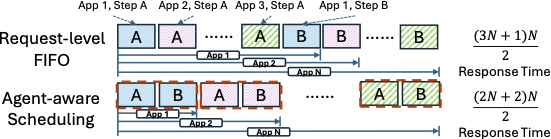

# Global Scheduler

Parrot’s **Global Scheduler** primarily addresses the issue of determining which machine to dispatch requests to (Note the distinction from the **Local Scheduler** on the Engine, which is primarily responsible for scheduling each iteration of the LLM, a.k.a continuous batching).

Thanks to Semantic Variables, we are able to extract a wealth of useful high-level information, which allows us to design various sophisticated scheduling strategies. This section introduces some of the builtin scheduling strategies of Parrot.

## QoS-aware Scheduling based on DAG

Due to the presence of batching, the per-token latency of an Engine is typically determined by the load of requests on it. We define our QoS as **the per-token latency of the generation process** (This is important in many streaming applications, such as, most importantly, chat). Parrot's Global Scheduler utilizes the DAG information to schedule requests such that each Engine will not violate the QoS requirement.

The detailed technique can be found in the 5.2 section of our paper.

## Application-level FIFO (Flow Scheduling)

When Parrot faces multiple analytic tasks (i.e. multiple chains with the same length), App-FIFO is a free lunch.

In the following example, we have N Applications (N analytic tasks) with each application composed of 2 steps / 2 LLM requests, denoting as A -> B. Intuitively, using App FIFO can achieve the best overall JCT (Job Completion Time). App FIFO v.s. Request-level FIFO is like depth-first order v.s. breadth-first order. In some cases like multiple chains with different lengths, the situation may be different and the latter strategy may be better.

## Context-aware Scheduling

Some of the scheduling strategies are co-designed between the high-level and low-level layers. Since the builtin `Engine` is equipped with [Shared Attention Kernel](../engine_layer/shared_attention_kernel.md), it's better to co-locate requests with the same prefix (i.e. with the same prefix `Context`) to the same machine whenever possible.
