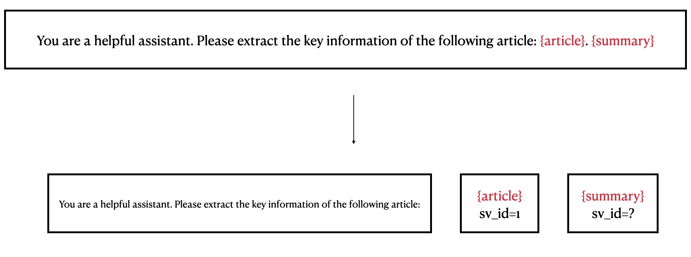
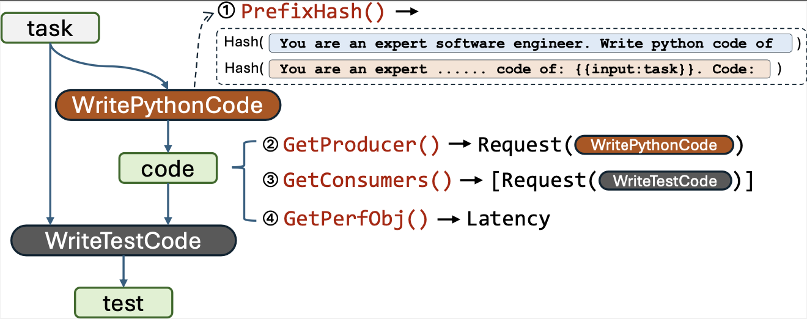

# Parrot Graph

Parrot's Graph is the core information we capture from the application, which describes the dependent relationship between requests. Parrot uses **Semantic Variable** to build its graph automatically. Users don't need to pass a whole DAG, but just use OpenAI-like completion APIs with some placeholders added, which makes our method easy to integrate with existing applications and easy to deploy in cloud.


## Dataflow Overview

To help readers have a vertical understanding of our system, we first explain our data pipeline in the Serve Layer, starting from a request coming from the Parrot API.

- Step 1: The request comes to the `semantic_call/` API route and the core calls `submit_semantic_call`.
- Step 2: The core finds the corresponding `Session` and calls its `add_request` method.
- Step 3: The session parses the request payload to the class `ChunkedSemanticCallRequest`.
- Step 4: Convert the `ChunkedSemanticCallRequest` into `RequestChain`, which consists of several `CompletionChain`.
- Step 5: Allocate `Semantic Variable`s for the `RequestChain`, and insert the chain into the graph of the `GraphExecutor`.
- Step 6: The executor will wait each `CompletionChain` to be ready. Once a `CompletionChain` is ready, it will be wrapped as a `CompletionTask` and put into the `GlobalScheduler`.
- Step 7: The scheduler will schedule the `CompletionTask` to certain `Engine`.
- Step 8: The executor will wait the task to be scheduled. Once it's scheduled, the executor will call `ContextManager` to assign `Context`s for this task.
- Step 9: Finally, execute the task by turning the body of task into several primitive requests (`Fill`, `Gen`) and pass to the `Engine` through HTTP.


## Request Parsing

Parrot API accepts requests with template prompts, i.e., a prompt string with some placeholders like `{{var_name}}`. First, it will be parsed into `ChunkedSemanticCallRequest`, which consists of a list of `RequestBodyChunk`. There are two types of chunk:
- `TextChunk`: Pure text. (You are a helpful assistant...)
- `PlaceholderNameChunk`: A name of a placeholder. (`{article}`) 



## Prefix Matcher

TODO

## Build Graph

### Construct Nodes

Then, Parrot will turn every `RequestBodyChunk` into corresponding `Node`s in the graph. There are three types of `Node`s in Parrot:
- `ConstantFill`: Converted from `TextChunk`.
- `PlaceholderFill`: Converted from `PlaceholderNameChunk` with a input placeholder.
- `PlaceholderGen`: Converted from `PlaceholderNameChunk` with a output placeholder.

The following picture shows a converting process.


### Bind Semantic Variables with Placeholders

Note that **Placeholder and Semantic Variable are two different concepts**. Placeholder is a part of the request / prompt, while Semantic Variable is independent of the request. However, each placeholder **can be bound to a Semantic Variable**. The Semantic Variable can be regarded as **a container of text**:
- If we bind a input placeholder to a Semantic Variable, it means we want to use the value (the text string stored in the Variable) to substitute (fill) the placeholder in the prompt.
- If we bind a output placeholder to a Semantic Variable, it means we want to use the previous text as a prompt to generate new text in this placeholder, then put the generated content into the Variable.

### Connect with Other Requests

At this point in the writing the reader may be wondering: where is the graph? It seems that we only talk about some conversion things in the above paragraph. Here comes the interesting part: we have actually finished the graph building, i.e., connect this new inserted request with other requests and form a DAG (Direct Acyclic Graph).

Remember that we previously mentioned Semantic Variables exist independently of requests. This means that placeholders in different requests may be bound to the same Semantic Variable.

Let me give you a simple example: an output placeholder in request A and an input placeholder in request B are bound to the same Semantic Variable. This implies that "the output of request A is exactly the input of request B". Through this kind of data flow analysis, we can understand the data dependencies between requests, i.e. building the graph.

So there are two types of nodes in this graph:
- One type corresponds to the points we derived from the `RequestBodyChunk`
- And the other type is the `Semantic Variable`.

Note that, according to our definition, these two types must alternate in the graph, meaning each edge connects a node of one type to a node of the other. In other words, this graph is a **bipartite graph**. However, for the sake of simplicity, We usually consolidate multiple nodes within a request into a single node, which makes it more similar to a traditional data flow diagram as follows:



Here `WritePythonCode` and `WriteTestCode` are two requests, connected by the Semantic Variable `code`.

## Some Terminologies

- **RequestChain** is a list of nodes that converted from `RequestBodyChunk`. Since these nodes have dependencies internally (The current node must wait for the previous node to complete execution before it can proceed), they forms a `Chain`:
    ```
    ConstantFill -> PlaceholderFill -> PlaceholderGen -> ConstantFill -> PlaceholderGen
    ```
- **CompletionChain** is a sub-chain of the `RequestChain`. Since we support multi-generation, which means we can have multiple output locs in the request body, there may be more than one `PlaceholderGen`s in a `RequestChain`. To represent the standard "completion" request in LLM serving, we split `RequestChain` into several `CompletionChain`, with each chain starting with continous `Fill`s and ending with a `Gen`:
    ```
    Fill -> Fill -> ... -> Fill -> Gen
    ```
    The `CompletionChain` is the basic unit of global scheduling. It will be turned into `CompletionTask` in the scheduler.