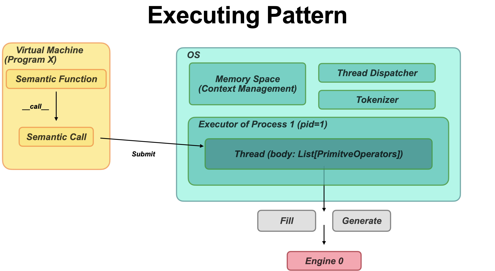

# V2

**Parrot: Scalable and Efficient Runtime System for Semantic Programming**

We designed a scalable and efficient runtime system for semantic programming. The system runs in cloud, managing hundreds of LLM engines and accepting multiple Program Clients running on it.


## Overall Architecture: Three-Layer System

- [Layer 1/Frontend] A minimal semantic programming language and a Virtual Machine Client.
- [Layer 2/Middle Layer] OS Layer. Managing multiple connections from VMs (Layer 1) and Engines (Layer 3), scheduling requests, managing memory and process live cycles.
- [Layer 3/Backend] Engine Layer. LLM Engines wrap the LLM Models, which serve the execution of Fill / Generate primitives.

## Problems

Request-level

- Objective mismatch (request & program).  (Map big batch size, reduce low latency).
- Diverse (latency & throughput). Annotated request.
- Request-level miss efficient Communications between calls.
- Request-level fine grains missed .

## Features

The system is efficient for those features (Top-Down order).

- [Program] Parrot program is **variable-level async**. Which enables larger batch size and unblocks the execution. Optimizing latency and throughput.
- [OS] Different threads **in the same Program** communicates with each other by token ids instead of text, avoiding repetitive tokenization and detokenization. And we implement token-pipelining between producers and consumers. (Communication)
    - Problem: Experiments should be carefully set to show the advantage of Token-pipelining.
- [OS] Different calls will share common prompts (system prompt).
- [OS] The thread dispatcher will perform DAG-aware scheduling to different threads, optimizing e2e latency.
- [OS] Different threads have different priority: latency-critical / throughput-critical (large batch). They will be put on different engines. (Single instance + Mixed).
- [Engine] Parrot engine (PE) has optimized kernels for fill/generation mixed workload.
- [Engine] The system can integrate different backends, from engines with extreme low latency (MLC-LLM) to engines with SOTA generation quality (OpenAI GPT).


## Different from V1

- **[Major]** Move main logic to OS Layer, and add a Virtual Machine Client in the Program Layer. (3-layer arch).
- Modify the workflow.
- Change some terminologies.

## Terminology

- **Semantic function** is the “function” in semantic programming. To be specific, it’s just a prompt template with multiple input locations and output locations. In Parrot, the semantic function we refer to is a minimal, experimental version of general semantic functions.
- **SemanticCall (Old name: LLM Call)** is a call of a semantic function. It will be submitted to the Executor. It contains the function and parameter map (name → value (str, PyObject, Future)).
- **Future (Old name: Placeholder)** is the placeholder of semantic functions’ inputs / outputs. It’s named after the similar concepts in asynchronous programming, which means the variable will be “filled” in the future. When we need its value, we should wait for its finishing.
- **SharedContext** is a program interface (frontend), which provides a permanent context for semantic functions to read / write. Users can use it as a memory to implement some stateful applications (such as Chatbot).
- **VirtualMachine / Process** is an instance which wraps the execution of the frontend program. The program contains two parts: native code and semantic code. The native code will be normally executed by the client’s Python Interpreter while the semantic functions are submitted to the ParrotOS.
- **Thread (Old name: Session)** is a running SemanticCall in the executor. Each thread has a unique `tid` in a process.
- **Context** is the memory in a function call. We propose this concept as an abstraction of KV cache in LLM. It can be either paged (paged-attention) or unpaged (past_key_values). We can fork a sub-context for a parent context, which provides API-support for prompt sharing.
- **Primitives** are the basic instructions for the backend to execute. In Parrot, there are only two types of Primitives: **Fill** and **Generation**.
    - Fill Primitive: pid, tid, context_id, parent_id, text (str), token_ids (List[int])
    - Generation Primitive: pid, tid, context_id, parent_id, sampling_config
    
    And in different layers, primitives have different representations:
    
    - Primitive Operators: (in DAG)
    - Primitive Requests: in requests
    - Primitive Jobs: (in Backends)
- **Interpreter** is responsible for translating Call to List[PrimitiveInstruction] for different engines.
    - TokenIdInterpreter
    - TextInterpreter
- **PCore** (Parrot OS Core) lies in the middle layer (OS Layer) of our system. It manages hundreds of engines in the Cloud, responsible for dispatching, load balancing, prefix sharing in different VMs and context managing.
- **LLM Engine** is the execution engine for semantic programming. To be specific, it is a LLM with some adaptions. Currently we have four types of engines:
    - Parrot Engine
    - HuggingFace Models
    - OpenAI API
    - MLC LLM

## Executing Pattern



## Protocols

| Name | Layer | URL | Args | Response |
| --- | --- | --- | --- | --- |
| Fill | OS Layer - Engine Layer | `/fill` | Fill Primitive to dict | num_fill_tokens |
| Generation | OS Layer - Engine Layer | `/generation` | Generation Primitive to dict | generated text / tokens |
| Generation (Stream) | OS Layer - Engine Layer | `/generation_stream` | Generation Primitive to dict | （Streaming) token generator |
| Register VM | Program Layer - OS Layer | `/register_vm` | - | pid (allocated) |
| VM Heartbeat | Program Layer - OS Layer | `/vm_heartbeat` | pid |  mem_used, num_threads |
| Submit Func Call | Program Layer - OS Layer | `/submit_call` | pid, call | - |
| Placeholder Fetch | Program Layer - OS Layer | `placeholder_fetch` | pid, placeholder_id | content (str) |
| Register Engine | OS Layer - Engine Layer | `/register_engine` | engine_config | engine_id (allocated) |
| Engine Heartbeat | OS Layer - Engine Layer | `/engine_hearbeat` | engine_id,
num_running_jobs,
num_cached_tokens.
cache_mem, 
model_mem | - |
| Free Context | OS Layer - Engine Layer | `/free_context` | context_id | num_freed_tokens |

## File Structures

```python
parrot
- utils.py
- constants.py
- os
	- process
    - interpreter.py
    - executor.py
    - thread.py
    - process.py
    - placeholder.py
    - pipe.py
    - thread_dispatcher.py
    - tokenizer.py
	- memory
    - context.py
    - mem_manager.py
    - garbage_collector.py
	- llm_engine.py
	- http_server.py
	- pcore.py
- engine
	- native
    - models
    - kernels
    - block_context.py
    - native_engine.py
    - http_server.py
    - iter_state.py
    - mem.py
    - model_instantiation.py
    - runner.py
	- openai
	- huggingface
	- mlcllm
	- scheduler.py
	- backend_jobs.py
	- low_level_context.py
	- config.py
- program
	- vm.py
- protocol
	- primitives.py
	- responses.py
	- layer_apis.py
	- sampling_configs.py
	- common.py
- testing

```

## Layer 1: Program Layer

 Initialization:

```python
client = P.VirtualMachine(os_addr)
vm.launch()
```

A virtual machine:

- Sends heartbeat to Runtime.
- Submit the `SemanticCall` to Runtime.

## Layer 2: Runtime Layer

The Runtime layer is responsible for managing the communication and coordination between the Virtual Machines (VMs) and the execution engines. It handles tasks such as dispatching SemanticCalls to the appropriate engines, load balancing, and managing the context of the execution. The Runtime layer plays a crucial role in ensuring the scalability and efficiency of the runtime system.

A Parrot Runtime includes:

- Thread Dispatcher. It will bind a thread with an backend engine.
- Context(Memory) Management and garbage collection.
- Process & Thread manager.
- Engines manager.
- Prefix cache.
- Executor.

### DAG aware scheduling

TODO

## Layer 3: Engine Layer

Engine Roles: latency or batching.